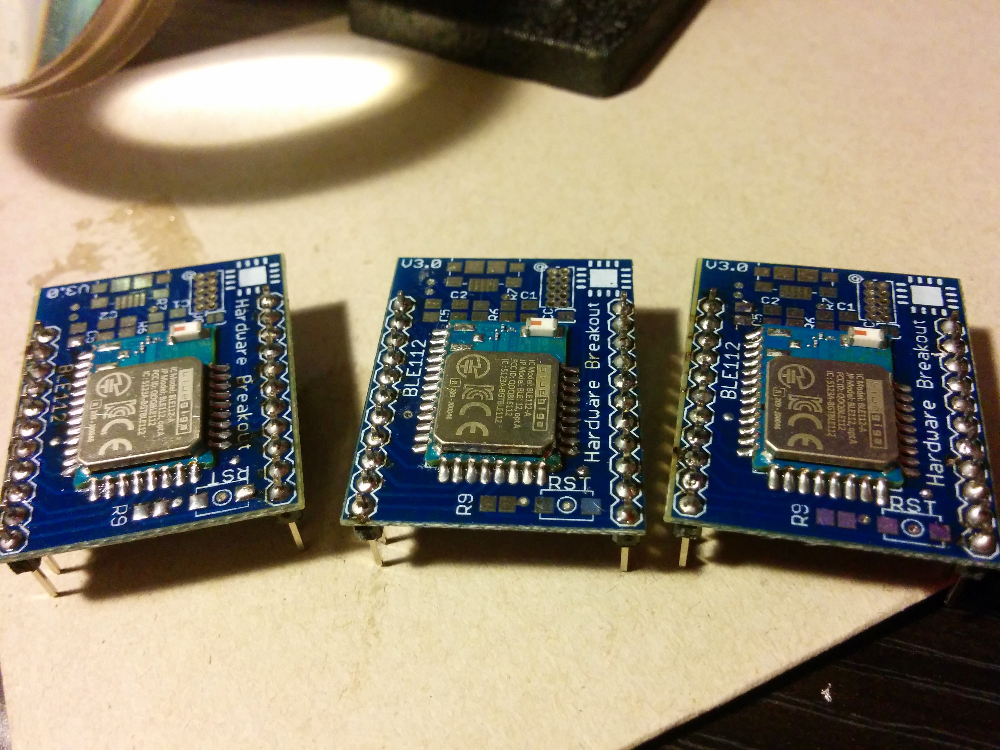
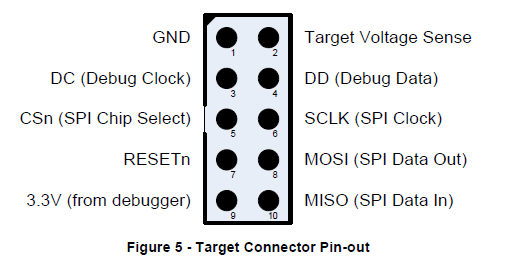
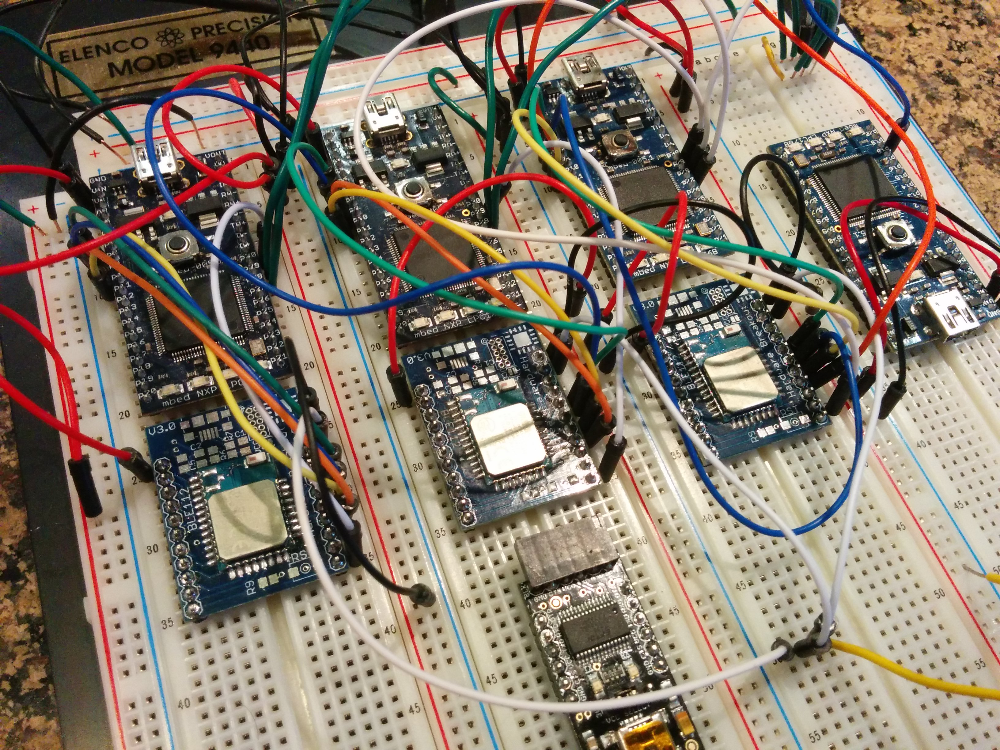

#Introduction

This repository contains all the code for BlueSync. This readme includes all the instructions needed to get the experiment up and running. 

All the work in this repository is the result of my work for an ENGR299 course at the University of California, Los Angeles. 

## What is BlueSync? ##

BlueSync is a time synchronization protocol intended to run on top of Bluetooth Low Energy (BLE).

For a more in-depth explanation of BlueSync, please check out [this article](bluesync.md). It's a whitepaper discussing all the components and concepts involved in BlueSync.

# Before You Begin #

You'll need the following hardware for the BlueSync Hub

* Raspberry Pi (or other Linux-based computer)
* BlueGiga BLED112 BLE USB Dongle
* mbed LPC1768 Microcontroller

For each BlueSync Sensor, you'll need the following:

* mbed LPC1768 Microcontroller
* Bluegiga BLE112 Bluetooth LE Module

Note that you will also require a TI CC Debugger **and a Windows PC** in order to flash firmware to the BLE112's onboard 8051 microcontroller.

The BLE112 module is a surface-mount component and will need to be soldered to a breakout board with headers for use on a breadboard. I recommmend looking at the PCB's available at [Hardware Breakout](http://store.hardwarebreakout.com/index.php?route=product/product&product_id=61). Note that you may need to purchase the male header pins separately.



You may want to purchase a FTDI breakout board in order to read data coming out of the BLE112. I used [this one](http://www.amazon.com/OSEPP-Breakout-Board-Arduino-Compatible/dp/B007JBSSGQ) from OSEPP because it has a jumper that lets it convert between 3.3V and 5V TTL, and it's got headers you can use to put it on a breadboard. SparkFun and Adafruit have boards too--any of them should work, provided that they can support the 3.3V logic that the BLE112 uses. **Just make sure it's using a [genuine FTDI chip](https://www.sparkfun.com/news/1629)**. 

# Software Installation #

## BlueSync Hub ##

Ensure that your environment has **Python 2**. This is important, as the [bglib library]() we're using is written for Python 2. Out of the box, most standard linux distributions come with Python 2, so you should be fine. 

Once this is done, simply clone this repository to the Pi, and issue the following commands:

```
cd <path_to_repo>/python
python bluesync.py
```

The software will immediately begin scanning for BLE devices.

### Headless Mode (Raspberry Pi) ###

This mode works if you'd like to run the code on a Raspberry Pi, but develop it on a more substantial Linux/Mac Machine. Clone this repo onto your development machine, and then follow [these instructions](http://quick2wire.com/painless-python-development-over-ssh-on-the-raspberry-pi/) to mount your source code on the Pi using SSHFS. 

Once this is complete, you can modify the files as you want on your development machine, and run the code on the Pi via a SSH login. 

## mbed LPC1768 ##

I used the mbed [Online Compiler](https://developer.mbed.org/compiler/
) to build the source code. There are two different mbed images that BlueSync need--[`event_source`](http://developer.mbed.org/users/dishbreak/code/event_source/) and [`bluesync`](http://developer.mbed.org/users/dishbreak/code/bluesync/). 

The source is available in this GitHub repo, but I recommend using the Online Compiler to import the projects.

### Importing Source from Mbed Compiler ###

Register an account on mbed, and visit each of the project pages here: 

* [`event_source`](http://developer.mbed.org/users/dishbreak/code/event_source/)
* [`bluesync`](http://developer.mbed.org/users/dishbreak/code/bluesync/)

Click *Import This Program* to add the code to your own compiler workspace. Once it's imported, double-click the program and click *Compile* in the toolbar at the top. This will create a `.bin` and download it to your computer. Connect the mbed to your computer via USB, and it should appear as a USB flash drive. Drag and drop the `.bin` file onto the mbed. 

One the file is uploaded to the mbed, reset the device by using the pushbutton on the board. On bootup, the mbed will check its USB storage, select the most recent binary, and flash it to the microcontroller using an on-board FTDI chip.

The mbeds used in the BlueSync sensors will need to be flashed with the `bluesync` project, while the mbed connected to the Raspberry Pi will need to be flashed with the `event_source` project.

## BlueGiga BLE112 ##

Create a login at BlueGiga's [website](https://www.bluegiga.com/). This will let you access their documentation and software.

Download and install the following software from [this page](https://www.bluegiga.com/en-US/products/software-bluegiga-bluetooth-smart/)--look for the list at the bottom.

* Bluetooth Smart Software and SDK v.1.3.2 (Software Releases)
* BLE Update Tool v1.0.6

In order to connect the CC debugger to the BLE 112, we'll need to use female-to-male jumper leads that can connect to the pins on the CC debugger connector. The connector is shown below:



Use this table to determine which pins on the BLE112 to connect to. You'll want to have a pinout for your breakout board handy.

CC Debugger Pin | BLE112 Pin 
----------------|----------------------
1 (GND) | GND
2 (Target Voltage Sense) | VDD
3 (Debug Clock) | P2_2
4 (Debug Data) | P2_1 
7 (RESETn) | RESET
9 (3.3V) | VDD

1. Connect the CC Debugger to a Windows PC via USB. If the connections are good, you should see a **green** LED light on the debugger. If you see a red light, double check your connections--something isn't correct.
2. Clone a copy of this repo to your Windows PC. 
3. Launch the **BLE SW Update Tool** on your Windows PC. 
4. Verify that your CC Debugger is seen by the tool, and click *Browse*. Navigate to `<repo_directory>\ble112_firmware\gpio_write\project-ble112.bgproj`. Click `Update`.
5. The tool should build, flash, and reset the BLE112. It's ready to go!

# Hardware Setup #

When I initally built out this experiment, I built it all on a single breadboard, like so:



There's no reason it has to be done this way, this was just what was easiest for my work. 

## Power Supply ##

I used the [SparkFun Benchtop Power Board Kit](https://www.sparkfun.com/products/12867), which allowed me to break out the 5V and 3.3V power lines from an ATX PC Power Supply. It's nice because it handles the minimum load requirement, includes fuses for each load line, and has a nifty little switch on the board. **Make sure you're clear on which rails on your breadboard are 3.3V and which are 5V.** The mbeds use 5V and the BLE112s use 3.3V. You'll be sorry if you get those two mixed up!

## Wiring For BlueSync Hub ##

The BlueSync Hub's wiring is simple. Insert the BLED112 USB dongle into one port, and connect the event source mbed into another port. I used a wireless USB adapter in my project, but you don't have to. 

## Wiring For BlueSync Sensor ##

Use the following table to determine wiring for the BlueSync sensor mbed. I used male-male jumper wires for this.

Connection | From Pin | To | To Pin
-----------|----------|----|-------
5V input  | VIN | 5V rail | N/A
Ground | GND | Ground rail | N/A
Serial TX | p9 | BLE112 | P0_5
Serial RX | P10 | BLE112 | P0_4
Serial RTS | p7 | BLE112 | P0_3
Serial CTS | p8 | BLE112 | P0_2
Advertising Capture Pin | p30 | BLE112 | P1_0
Sensing Capture Pin | p29 | event source mbed | p18
Sensing Interrupt Pin | p28 | event source mbed | p18

Additionally, make sure to connect VDD and GND on each of the BLE112s to the 3.3V rail and ground rail, respectively. You may want to wire all RESET pins to a pushbutton that shorts to ground when pressed, but it's not strictly required--it's merely a quick way to reboot all BLE112s at once.

## LED Status Lights ##

You could use the virtual COM port on the USB interface to get debug messages via the console. However, that's not strictly necessary. The LED status panel indicates various states of the BlueSync sensor.

LED | Meaning
----|--------
LED1 | Sensor is in slave mode. If the serial link is functioning, this light should be lit on bootup.
LED2 | Sensor is in master mode and is scanning for advertisements.
LED3 | Sensor received an advertisement from the BlueSync hub, and has stopped scanning. Stays lit for 1 second.
LED4 | Alternates every 5 seconds. Used to determine that the MCU hasn't hung.

# Running the Experiment

Once all the connections are made, switch on the power, and invoke `bluesync.py` on the BlueSync hub. You should see the following:

* The bluesync scanner picks up all devices, listing them by MAC.
* After completing service discovery, the bluesync hub will trigger scanning on all nodes, causing LED2 to be lit on the mbeds
* After the hub transmits its advertisments, LED3 should be lit on all mbeds.
* After a second, LED1 should be lit.

The bluesync.py script will write to an output file as it calculates offsets and error.
